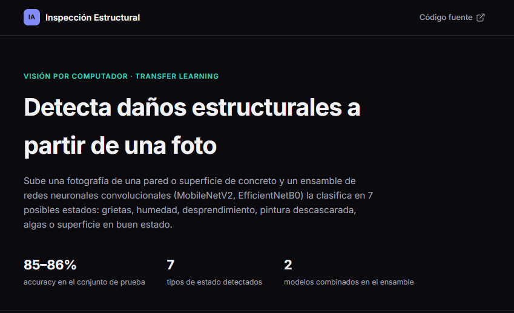

# Portafolio Profesional de Ingeniería de Software

Portafolio web responsivo y accesible desarrollado con HTML5 semántico, CSS3 modular y JavaScript ES6+, estructurado con arquitectura visual mediante CSS Custom Properties y Design System documentado.

- **Autor:** Alexis David Cajamarca Largo
- **Institución:** Universidad Estatal de Milagro (UNEMI)
- **Carrera:** Ingeniería de Software
- **Despliegue (GitHub Pages):** [https://cajamarcalargo.github.io/portafolio-web/](https://cajamarcalargo.github.io/portafolio-web/)

---

## 📸 Vista Previa del Proyecto

| Vista Principal (Hero & Skills) | Sistema de Diseño (Design System) |
| :---: | :---: |
|  |  |

---

## 🛠️ Tecnologías y Herramientas Utilizadas

- **HTML5:** Marcado semántico estructurado (`header`, `nav`, `main`, `section`, `article`, `figure`, `figcaption`, `aside`, `footer` y formularios accesibles).
- **CSS3 Puro:** Metodología modular, CSS Custom Properties (tokens de color, espaciado, tipografía), CSS Grid, Flexbox y Media Queries.
- **JavaScript (ES6+):** Interactividad dinámica sin dependencias externas:
  - Alternador de tema claro/oscuro con persistencia en `localStorage`.
  - Menú hamburguesa responsive para dispositivos móviles.
  - Slider y carrusel automático de capturas de proyectos.
  - Botón flotante para retorno al inicio con detección de scroll.
  - Validación de campos del formulario de contacto en tiempo real con feedback visual.
- **Iconografía:** [Devicon](https://devicon.dev/) para el ecosistema tecnológico.

---

## 📌 Proyectos Destacados

1. **Sistema de Inspección de Defectos Estructurales**
   - *Problema:* Lentitud y fallas de consistencia en la evaluación visual manual de grietas y patologías en edificaciones.
   - *Solución:* Plataforma web que procesa imágenes mediante transfer learning (MobileNetV2) para clasificar daños y centralizar reportes técnicos.
   - *Stack:* Django, Python, TensorFlow / MobileNetV2, PostgreSQL.
   - *Enlaces:* [Repositorio](https://github.com/jeandaly20/Deteccion-de-da-os-Estructurales) | [Demo](https://deteccion-de-da-os-estructurales.onrender.com)

2. **The Grapes**
   - *Problema:* Limitaciones de rendimiento y renderizado al construir mecánicas de combate y estados de enemigos en juegos de escritorio 2D.
   - *Solución:* Videojuego RPG 2D implementando Game Loop, detección de colisiones, audio espacial y sistema de parry.
   - *Stack:* Java, POO, Renderizado 2D, Lógica Algorítmica.
   - *Enlaces:* [Ver Demo](https://drive.google.com/file/d/1jJgwmEXFFDz2209SXi5J0sJqZUmSQ1qq/view)

3. **NutriSaaS - Plataforma Clínica B2B2C**
   - *Problema:* Riesgo de filtración de expedientes médicos y cálculos manuales lentos de requerimientos dietéticos.
   - *Solución:* Arquitectura SaaS multi-tenant con esquemas de base de datos aislados por clínica, expedientes 360° y catálogo híbrido de alimentos.
   - *Stack:* Laravel (PHP), React, Tailwind CSS, PostgreSQL Multi-Tenant, Scrum / Jira.
   - *Acceso:* Repositorio privado corporativo (NDA).

---

## 🎨 Design System y Arquitectura Visual

La plataforma cuenta con una página de documentación formal accesible en `design-system.html`:
- **Tokens Semánticos:** Definición de paletas de color con valores HEX visibles tanto en tema claro como oscuro.
- **Jerarquía Tipográfica:** Muestrario de encabezados (`h1`, `h2`, `h3`), enlaces interactivos y texto de cuerpo con interlineado optimizado.
- **Escala de Espaciados:** Normalización de dimensiones desde `4px` (`--space-xs`) hasta `64px` (`--space-2xl`).
- **Muestrario de Componentes UI:** Botones primarios, secundarios, cards modulares de proyectos, tech-badges, inputs y navbar.

---

## 📂 Estructura del Repositorio

```text
portafolio-web/
├── assets/
│   └── img/               # Recursos gráficos y fotografías
├── css/
│   ├── variables.css      # Custom Properties y variables de tema
│   └── styles.css         # Estilos globales, componentes y media queries
├── js/
│   └── main.js            # Lógica e interactividad del DOM
├── index.html             # Página principal del portafolio
├── design-system.html     # Documentación viva de componentes
└── README.md              # Documentación técnica del proyecto